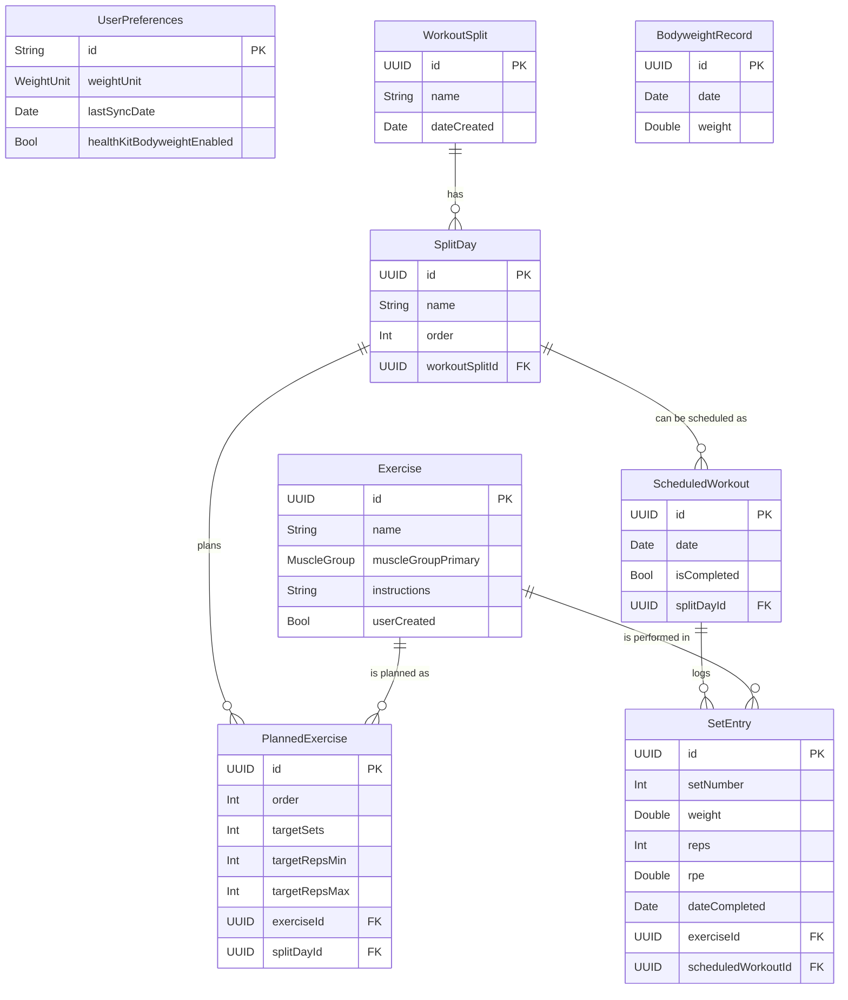

# 03 – Data Model (SwiftData)

This document details the SwiftData models for the Overload PT application. These models represent the core entities that will be persisted locally using SwiftData and synced via CloudKit.

## Core Entities

```swift
import SwiftData
import Foundation

// Main entity representing a specific exercise.
@Model
final class Exercise {
    @Attribute(.unique) var id: UUID
    var name: String                 // e.g., "Barbell Bench Press", "Dumbbell Squat"
    var muscleGroupPrimary: MuscleGroup // Primary muscle group targeted
    var muscleGroupsSecondary: [MuscleGroup]? // Secondary muscle groups
    var equipment: EquipmentType?         // e.g., Barbell, Dumbbell, Machine
    var instructions: String?             // Optional text instructions or link to video
    var userCreated: Bool                 // True if user defined, false if pre-loaded

    // Relationships
    @Relationship(inverse: \SetEntry.exercise) var setEntries: [SetEntry]? = []
    @Relationship(inverse: \PlannedExercise.exercise) var plannedExercises: [PlannedExercise]? = []

    init(id: UUID = .init(), name: String, muscleGroupPrimary: MuscleGroup, muscleGroupsSecondary: [MuscleGroup]? = nil, equipment: EquipmentType? = nil, instructions: String? = nil, userCreated: Bool = false) {
        self.id = id
        self.name = name
        self.muscleGroupPrimary = muscleGroupPrimary
        self.muscleGroupsSecondary = muscleGroupsSecondary
        self.equipment = equipment
        self.instructions = instructions
        self.userCreated = userCreated
    }
}

// Represents a user-defined workout split (e.g., "Push Pull Legs", "Upper/Lower").
@Model
final class WorkoutSplit {
    @Attribute(.unique) var id: UUID
    var name: String // e.g., "My PPL Split"
    var notes: String?
    var dateCreated: Date

    // Relationships
    @Relationship(deleteRule: .cascade) var days: [SplitDay]? = [] // Ordered list of days in the split

    init(id: UUID = .init(), name: String, notes: String? = nil, dateCreated: Date = .now) {
        self.id = id
        self.name = name
        self.notes = notes
        self.dateCreated = dateCreated
    }
}

// Represents a specific day within a WorkoutSplit (e.g., "Push Day", "Leg Day A").
@Model
final class SplitDay {
    @Attribute(.unique) var id: UUID
    var name: String        // e.g., "Push 1", "Legs"
    var order: Int          // To maintain order within the split

    // Relationships
    var split: WorkoutSplit? // Back-reference to the parent split
    @Relationship(deleteRule: .cascade) var plannedExercises: [PlannedExercise]? = [] // Exercises planned for this day

    init(id: UUID = .init(), name: String, order: Int, split: WorkoutSplit? = nil) {
        self.id = id
        self.name = name
        self.order = order
        self.split = split
    }
}

// Represents an exercise planned for a specific SplitDay, including target sets/reps.
@Model
final class PlannedExercise {
    @Attribute(.unique) var id: UUID
    var order: Int // Order of exercise within the workout day
    var targetSets: Int
    var targetRepsMin: Int?
    var targetRepsMax: Int?
    var targetRPE: Double?
    var notes: String?

    // Relationships
    var exercise: Exercise? // The actual exercise
    var splitDay: SplitDay? // The day this planned exercise belongs to

    init(id: UUID = .init(), order: Int, targetSets: Int, targetRepsMin: Int? = nil, targetRepsMax: Int? = nil, targetRPE: Double? = nil, notes: String? = nil, exercise: Exercise? = nil, splitDay: SplitDay? = nil) {
        self.id = id
        self.order = order
        self.targetSets = targetSets
        self.targetRepsMin = targetRepsMin
        self.targetRepsMax = targetRepsMax
        self.targetRPE = targetRPE
        self.notes = notes
        self.exercise = exercise
        self.splitDay = splitDay
    }
}

// Represents a scheduled workout session in the calendar.
@Model
final class ScheduledWorkout {
    @Attribute(.unique) var id: UUID
    var date: Date // Date and time the workout is scheduled for
    var isCompleted: Bool = false
    var notes: String?

    // Relationships
    var splitDay: SplitDay? // The specific day from a split being performed
    // If not from a split (e.g., a one-off workout), plannedExercises could be directly linked here or handled differently.
    // For MVP, we assume workouts are scheduled from a SplitDay.
    @Relationship(deleteRule: .cascade) var completedSets: [SetEntry]? = [] // Actual sets performed for this scheduled workout

    init(id: UUID = .init(), date: Date, splitDay: SplitDay?, notes: String? = nil) {
        self.id = id
        self.date = date
        self.splitDay = splitDay
        self.notes = notes
    }
}

// Represents a single set performed by the user for a given exercise.
@Model
final class SetEntry {
    @Attribute(.unique) var id: UUID
    var setNumber: Int
    var weight: Double      // In user's preferred unit (kg/lbs)
    var reps: Int
    var rpe: Double?        // Rate of Perceived Exertion (e.g., 1-10)
    var dateCompleted: Date
    var notes: String?
    var restTimeSeconds: Int? // Optional rest time taken before this set

    // Relationships
    var exercise: Exercise? // The exercise performed
    var scheduledWorkout: ScheduledWorkout? // The workout session this set belongs to

    init(id: UUID = .init(), setNumber: Int, weight: Double, reps: Int, rpe: Double? = nil, dateCompleted: Date = .now, notes: String? = nil, restTimeSeconds: Int? = nil, exercise: Exercise? = nil, scheduledWorkout: ScheduledWorkout? = nil) {
        self.id = id
        self.setNumber = setNumber
        self.weight = weight
        self.reps = reps
        self.rpe = rpe
        self.dateCompleted = dateCompleted
        self.notes = notes
        self.restTimeSeconds = restTimeSeconds
        self.exercise = exercise
        self.scheduledWorkout = scheduledWorkout
    }
}

// User-specific preferences.
@Model
final class UserPreferences {
    var id: String = "singleton" // Use a fixed ID for a single preferences object
    var weightUnit: WeightUnit = .kilograms
    var lastSyncDate: Date?
    var healthKitBodyweightEnabled: Bool = false
    // Add other preferences as needed

    init(id: String = "singleton", weightUnit: WeightUnit = .kilograms, lastSyncDate: Date? = nil, healthKitBodyweightEnabled: Bool = false) {
        self.id = id
        self.weightUnit = weightUnit
        self.lastSyncDate = lastSyncDate
        self.healthKitBodyweightEnabled = healthKitBodyweightEnabled
    }
}

// Bodyweight record, potentially synced from HealthKit or manually entered.
@Model
final class BodyweightRecord {
    @Attribute(.unique) var id: UUID
    var date: Date
    var weight: Double // In user's preferred unit

    init(id: UUID = .init(), date: Date, weight: Double) {
        self.id = id
        self.date = date
        self.weight = weight
    }
}

```

## Enums & Supporting Structs

```swift
// Enum for primary muscle groups.
enum MuscleGroup: String, Codable, CaseIterable, Identifiable {
    case chest, back, shoulders, biceps, triceps, forearms, quadriceps, hamstrings, glutes, calves, abs, fullBody, other
    var id: String { self.rawValue }
}

// Enum for equipment types.
enum EquipmentType: String, Codable, CaseIterable, Identifiable {
    case barbell, dumbbell, machine, cable, bodyweight, kettlebell, band, other
    var id: String { self.rawValue }
}

// Enum for weight units.
enum WeightUnit: String, Codable, CaseIterable, Identifiable {
    case kilograms = "kg"
    case pounds = "lbs"
    var id: String { self.rawValue }
}
```

## ER Diagram (Conceptual)



## Derived Metrics (Reiteration from Spec)
These are not stored directly but calculated on-the-fly or when needed for display/analysis:
*   **Volume per Set** = `weight × reps`
*   **Total Volume for Exercise (in a workout)** = Sum of `(weight × reps)` for all sets of that exercise.
*   **Epley 1RM Estimate** = `weight × (1 + reps / 30.0)` (for a single set, typically the top set).

## Relationships & Delete Rules
*   **WorkoutSplit to SplitDay:** `.cascade` - If a split is deleted, its constituent days are also deleted.
*   **SplitDay to PlannedExercise:** `.cascade` - If a split day is deleted, its planned exercises are also deleted.
*   **ScheduledWorkout to SetEntry:** `.cascade` - If a scheduled workout is deleted, all logged sets for it are also deleted.
*   **Exercise to SetEntry/PlannedExercise:** `.nullify` (default or set explicitly if needed) - If an exercise is deleted, references in SetEntry or PlannedExercise should be handled gracefully (e.g., show "Deleted Exercise" or prevent deletion if in use, TBD based on UX).
    *   *Correction:* For `SetEntry` and `PlannedExercise` referencing `Exercise`, if an `Exercise` is deleted, it might be better to prevent deletion if it's part of any logs or plans, or to mark the `Exercise` as archived instead of a hard delete. For now, SwiftData's default is `.nullify` if the relationship is optional, or a crash if not optional and not handled. We will use optional relationships for `exercise` in `SetEntry` and `PlannedExercise` and handle the UI appropriately if an exercise is missing.

## Considerations for CloudKit Sync
*   All `@Model` classes will be eligible for CloudKit syncing.
*   Ensure `UUID`s are used for stable identifiers across devices.
*   Handle potential sync conflicts (though SwiftData and CloudKit manage much of this automatically for basic cases).
*   Large binary data (e.g., exercise images/videos if added later) would need special handling (e.g., `CKAsset` or external storage), but is not in MVP.

---
**Next action** → Review and finalize this Data Model. Then proceed to update `04-ai-api.md`.